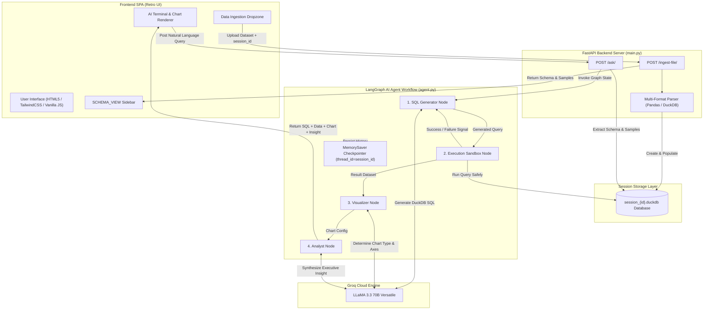
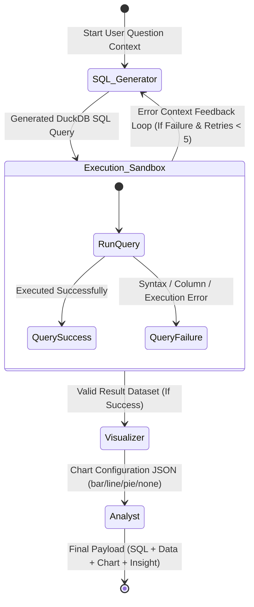
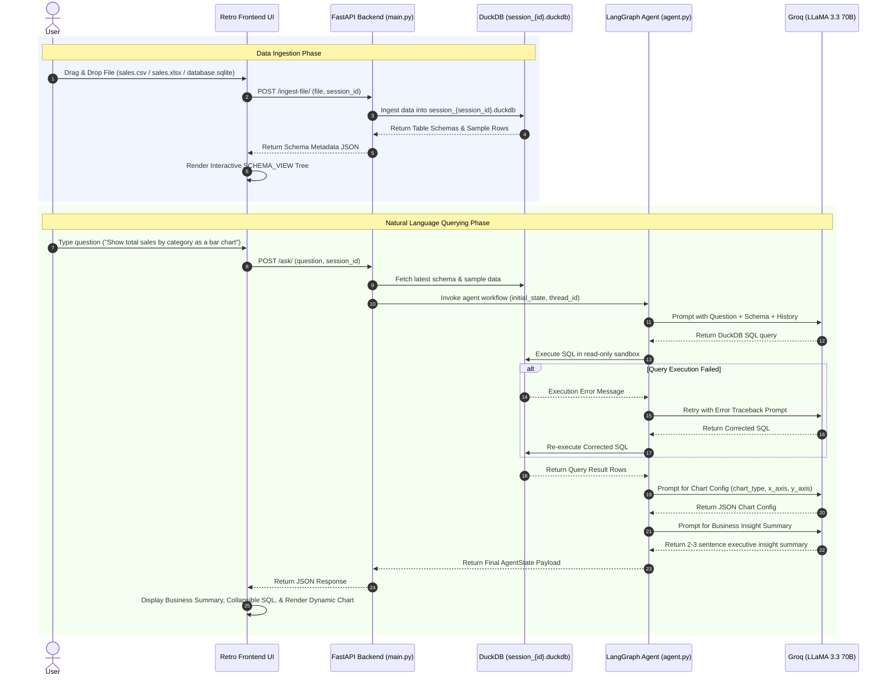

# 🖥️ ANALYTICS_OS_V1.0

> **An Interactive, Retro-Styled, AI-Powered Data Analytics Operating System**
> Built with **FastAPI**, **DuckDB**, **LangGraph**, **Groq (LLaMA 3.3 70B)**, and **TailwindCSS**.

---

## Table of Contents
- [Overview](#-overview)
- [Key Features](#-key-features)
- [System Architecture](#-system-architecture)
  - [1. High-Level System Architecture](#1-high-level-system-architecture)
  - [2. LangGraph Agent State Diagram](#2-langgraph-agent-state-diagram)
  - [3. End-to-End Data & Query Flow](#3-end-to-end-data--query-flow)
- [Project Structure](#-project-structure)
- [Technology Stack](#-technology-stack)
- [Setup & Installation](#-setup--installation)
  - [Prerequisites](#prerequisites)
  - [Installation Steps](#installation-steps)
- [Usage Walkthrough](#-usage-walkthrough)
- [API Reference](#-api-reference)
- [Configuration Reference](#-configuration-reference)
- [License](#-license)

---

## Overview

**ANALYTICS_OS_V1.0** is an end-to-end, LLM-powered data analytics assistant wrapped in a nostalgic 90s pixel-art desktop environment. Users can drag and drop raw datasets in various formats (CSV, Excel, SQL, SQLite), and analyze their data using plain English natural language queries. 

Behind the vintage UI sits a high-performance backend:
- **DuckDB** executes lightning-fast analytical SQL queries locally in memory or file storage.
- **LangGraph** orchestrates an autonomous multi-node AI agent pipeline with built-in self-correction loops.
- **Groq (LLaMA 3.3 70B)** translates user questions into valid DuckDB SQL, designs chart visualization parameters, and synthesizes clear, executive business summaries.

---

## Key Features

| Feature | Category | Description |
| :--- | :--- | :--- |
| **Universal File Ingestion** | Data Pipeline | Drag-and-drop support for `.csv`, `.xlsx`, `.xls`, `.sql`, `.sqlite`, and `.db` files. |
| **Session Isolation** | Security & Privacy | Every chat session generates a dedicated `session_{id}.duckdb` database, ensuring complete zero-leakage isolation between users. |
| **Agentic SQL Generation** | AI Agent | Translates complex natural language questions into valid DuckDB SQL queries utilizing database schema definitions and sample rows. |
| **Autonomous Self-Correction** | Robustness | If a generated query fails in the execution sandbox, the error traceback is fed back into the agent context to automatically fix syntax/logic errors (up to 5 retries). |
| **Automated Visualizations** | Data UX | Automatically selects the optimal graph format (`bar`, `line`, `pie`, `none`) and configures axis mappings dynamically. |
| **Executive Business Summaries**| Insights | Synthesizes complex analytical query results into concise 2–3 sentence business summaries, concealing SQL technicalities. |
| **Retro 90s OS UI** | Frontend | Pixel-art desktop interface built with TailwindCSS, custom monospace fonts (`JetBrains Mono`, `Space Mono`), windows, titlebars, and collapsible schema trees. |
| **Stateful Conversation Memory** | Context | Leverages LangGraph `MemorySaver` checkpointers to support contextual multi-turn follow-up questions. |

---

## System Architecture

### 1. High-Level System Architecture



---

### 2. LangGraph Agent State Diagram



---

### 3. End-to-End Data & Query Flow



---

## Project Structure

```
LLM-powered agent/
├── main.py                 # FastAPI server: Ingestion, schema extraction, and query endpoints
├── agent.py                # LangGraph agent definition, nodes, router logic, and LLM setup
├── report.md               # Detailed technical architecture report
├── README.md               # Project documentation (this file)
├── .env.example            # Environment variable template file
├── .gitignore              # Git ignore rules for virtualenvs, DuckDB files, and secrets
├── app_data.duckdb         # Default sandbox DuckDB database
└── frontend/
    └── index.html          # Retro 90s OS Single Page Application (HTML, TailwindCSS, JS)
```

---

## Technology Stack

| Component | Technology | Description |
| :--- | :--- | :--- |
| **Backend Framework** | [FastAPI](https://fastapi.tiangolo.com/) | High-performance asynchronous Python web framework |
| **OLAP Database** | [DuckDB](https://duckdb.org/) | Embedded analytical in-process SQL database engine |
| **Agent Orchestration**| [LangGraph](https://github.com/langchain-ai/langgraph) | Cyclic state machine graph framework for LLM agents |
| **LLM Integration** | [LangChain Groq](https://python.langchain.com/) | Driver connecting LangChain components to Groq models |
| **Language Model** | LLaMA 3.3 70B Versatile | Ultra-fast inference model provided via [Groq Cloud](https://groq.com/) |
| **Data Processing** | Pandas, OpenPyXL | Excel/CSV ingestion, transformation, and array formatting |
| **Frontend UI** | HTML5, Vanilla JavaScript | Client SPA with custom pixel-art UI components |
| **Styling** | [TailwindCSS (CDN)](https://tailwindcss.com/) | Utility-first CSS framework for retro OS design system |
| **Typography** | JetBrains Mono, Space Mono | Google Fonts monospace fonts for terminal aesthetic |

---

## Setup & Installation

### Prerequisites
- **Python 3.9+** installed on your system.
- **Groq API Key**: Obtain a free API key from [Groq Console](https://console.groq.com/).

---

### Installation Steps

#### 1. Clone the Repository
```bash
git clone https://github.com/Adarsh-Shekhar/ANALYTICS_OS_V1.0.git
cd ANALYTICS_OS_V1.0
```

#### 2. Create and Activate Virtual Environment

**On Windows (PowerShell):**
```powershell
python -m venv .venv
.\.venv\Scripts\Activate.ps1
```

**On Linux / macOS:**
```bash
python -m venv .venv
source .venv/bin/activate
```

#### 3. Install Required Dependencies
```bash
pip install fastapi uvicorn python-multipart pydantic duckdb pandas \
            langgraph langchain-core langchain-groq python-dotenv openpyxl
```

#### 4. Configure Environment Variables
Copy `.env.example` to `.env` in the root directory:
```bash
cp .env.example .env
```
Open `.env` and enter your Groq API key:
```env
GROQ_API_KEY=gsk_your_actual_groq_api_key_here
```

#### 5. Launch the Server
```bash
uvicorn main:app --reload
```

#### 6. Access the Application
Open your browser and navigate to:
```
http://127.0.0.1:8000
```

---

## 🎮 Usage Walkthrough

1. **Launch Dashboard**: Open `http://127.0.0.1:8000`. A unique `session_id` UUID is generated automatically to isolate your workspace.
2. **Ingest Dataset**:
   - Drag and drop a file (e.g., `sales.csv` or `database.sqlite`) into the **DATA_INGESTION** dropzone in the left panel.
   - Click **UPLOAD DATASET**.
3. **Explore Schema**: View the auto-populated **SCHEMA_VIEW** tree showing all extracted tables and column data types.
4. **Ask Analytical Questions**: Type your prompt into the **AI_ASSISTANT.EXE** terminal input:
   - *"What is the total revenue across all product categories?"*
   - *"Show revenue by category as a bar chart."*
   - *"Which top 5 items sold the highest quantity?"*
5. **Review Output**:
   - **Business Summary**: Read the 2-3 sentence executive insight.
   - **Generated SQL**: Click to inspect the exact DuckDB query constructed by the agent.
   - **Dynamic Visualization**: View rendered bar/line/pie charts directly inside the terminal window.

---

## API Reference

### 1. `GET /`
Serves the retro desktop Single Page Application (`frontend/index.html`).

---

### 2. `POST /ingest-file/`
Uploads a dataset and loads it into a session-isolated DuckDB database.

**Request Type:** `multipart/form-data`

| Parameter | Type | Required | Description |
| :--- | :--- | :--- | :--- |
| `file` | File | Yes | Uploaded dataset file (`.csv`, `.xlsx`, `.xls`, `.sql`, `.sqlite`, `.db`) |
| `session_id` | String | Yes | Unique session UUID |

**Sample Response:**
```json
{
  "status": "success",
  "session_id": "8f3b2c1a-4e5d-6f7a-8b9c-0d1e2f3a4b5c",
  "uploaded_file": "sales.csv",
  "tables_loaded": ["sales"],
  "schema": {
    "sales": {
      "id": "INTEGER",
      "category": "VARCHAR",
      "revenue": "DOUBLE",
      "quantity": "INTEGER"
    }
  }
}
```

---

### 3. `POST /ask/`
Submits a natural language query to the LangGraph AI agent pipeline.

**Request Type:** `application/json`

**Sample Request Body:**
```json
{
  "question": "Show revenue by category as a bar chart",
  "session_id": "8f3b2c1a-4e5d-6f7a-8b9c-0d1e2f3a4b5c"
}
```

**Sample Response:**
```json
{
  "status": "success",
  "question": "Show revenue by category as a bar chart",
  "generated_sql": "SELECT category, SUM(revenue) AS total_revenue FROM sales GROUP BY category ORDER BY total_revenue DESC",
  "final_data": [
    { "category": "Electronics", "total_revenue": 125000.0 },
    { "category": "Apparel", "total_revenue": 89000.0 },
    { "category": "Home", "total_revenue": 45000.0 }
  ],
  "chart_config": {
    "chart_type": "bar",
    "x_axis_key": "category",
    "y_axis_key": "total_revenue",
    "title": "Total Revenue by Category"
  },
  "analysis_summary": "Electronics generated the highest revenue at $125,000, followed by Apparel at $89,000. The top two categories account for over 83% of total revenue."
}
```

---

## Configuration Reference

| Parameter | File Location | Default | Description |
| :--- | :--- | :--- | :--- |
| `GROQ_API_KEY` | `.env` | None | API Key required for Groq cloud inference |
| `model` | `agent.py` | `llama-3.3-70b-versatile` | Groq LLM model name |
| `temperature` | `agent.py` | `0` | LLM temperature (0 ensures deterministic output) |
| `recursion_limit` | `main.py` | `5` | Maximum retries for the agent self-correction loop |
| `db_file` | `main.py` | `session_{session_id}.duckdb` | Per-session DuckDB file name pattern |

---