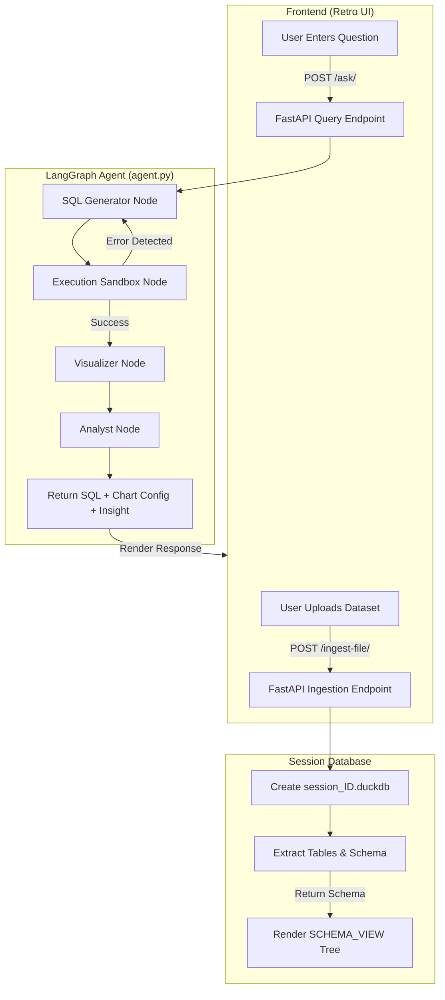
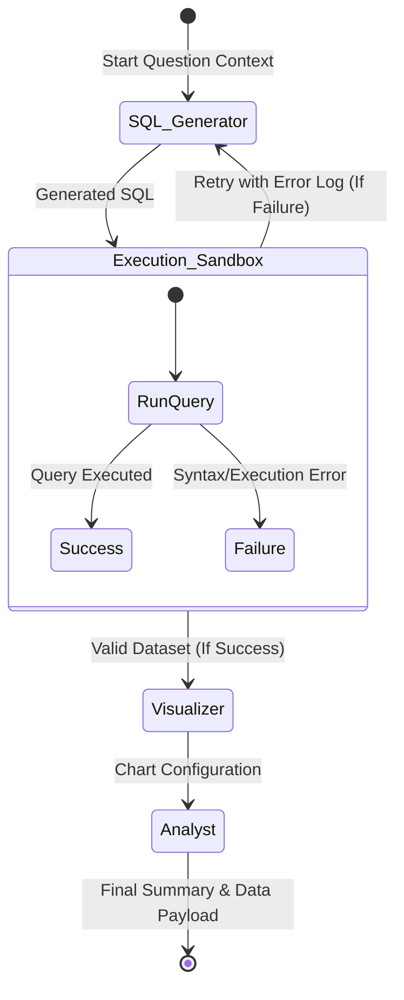

# ANALYTICS_OS_V1.0

> An interactive, retro-styled, AI-powered data analytics operating system built with **FastAPI**, **DuckDB**, **LangGraph**, and **Groq (LLaMA 3.3 70B)**. Upload datasets (CSV, Excel, SQL, SQLite) and analyze them using natural language—the system auto-generates SQL, executes it safely, renders charts, and delivers plain-English insights.

---

## Table of Contents
- [Key Features](#key-features)
- [System Architecture](#system-architecture)
- [LangGraph Agent Workflow](#langgraph-agent-workflow)
- [Project Structure](#project-structure)
- [Technology Stack](#technology-stack)
- [Setup & Installation](#setup--installation)
- [Usage Walkthrough](#usage-walkthrough)
- [API Endpoints](#api-endpoints)
- [Frontend UI Preview](#frontend-ui-preview)
- [Configuration](#configuration)
- [License](#license)

---

## Key Features

| Feature | Description |
|---------|-------------|
| **Universal File Ingestion** | Drag-and-drop support for `.csv`, `.xlsx`, `.xls`, `.sql`, `.sqlite`, `.db` |
| **Session-Aware Isolation** | Each chat session gets its own `session_{id}.duckdb` — no cross-user data leakage |
| **Agentic SQL Generation** | LLaMA 3.3 70B translates natural language → valid DuckDB SQL |
| **Self-Correction Loop** | On SQL error, the agent retries with the error context (max 5 retries via LangGraph recursion limit) |
| **Auto-Visualization** | AI selects chart type (bar/line/pie/none) and maps axes automatically |
| **Business Insights** | 2–3 sentence plain-English summary hiding SQL complexity |
| **Retro 90s OS UI** | Pixel-art terminal aesthetic via TailwindCSS + custom CSS (JetBrains Mono / Space Mono) |
| **Persistent Chat Memory** | LangGraph `MemorySaver` checkpointer keyed by `session_id` |

---

## System Architecture

### High-Level Flowchart



### LangGraph Agent Workflow



---

## Project Structure

```
LLM-powered agent/
├── main.py                 # FastAPI server: ingestion, static serve, AI query endpoints
├── agent.py                # LangGraph state machine, nodes, Groq/LLaMA-3 integration
├── report.md               # Comprehensive architecture & technical report
├── README.md               # This file
├── .env                    # Environment variables (GROQ_API_KEY)
├── app_data.duckdb         # Default/fallback DuckDB database
└── frontend/
    └── index.html          # Retro UI SPA (HTML, TailwindCSS CDN, Vanilla JS)
```

---

## Technology Stack

| Layer | Technology | Purpose |
|-------|------------|---------|
| **API Framework** | FastAPI | Async Python web framework for endpoints |
| **Database** | DuckDB | Embedded analytical SQL OLAP engine |
| **Agent Orchestration** | LangGraph + LangChain | Multi-node stateful workflow & LLM chaining |
| **LLM Provider** | Groq (LLaMA 3.3 70B Versatile) | Ultra-fast SQL generation, analysis, viz config |
| **Data Processing** | Pandas, OpenPyXL | Excel/CSV parsing, DataFrame manipulation |
| **Frontend** | TailwindCSS (CDN) + Vanilla JS | Retro pixel-art UI, dynamic chart rendering |
| **Fonts** | JetBrains Mono, Space Mono | Monospace terminal aesthetic |

---

## Setup & Installation

### Prerequisites
- **Python 3.9+**
- **Groq API Key** → [Get one free at console.groq.com](https://console.groq.com/)

### 1. Clone & Enter Project
```bash
git clone <repository-url>
cd "LLM-powered agent"
```

### 2. Create & Activate Virtual Environment
```bash
# Windows (PowerShell)
python -m venv .venv
.venv\Scripts\Activate.ps1

# Linux / macOS
python -m venv .venv
source .venv/bin/activate
```

### 3. Install Dependencies
```bash
pip install fastapi uvicorn python-multipart pydantic duckdb pandas \
            langgraph langchain-core langchain-groq python-dotenv openpyxl
```

### 4. Configure Environment
Create `.env` in the project root:
```env
GROQ_API_KEY=your_groq_api_key_here
```

### 5. Launch the Server
```bash
uvicorn main:app --reload
```

### 6. Open in Browser
Navigate to **http://127.0.0.1:8000**

---

## Usage Walkthrough

1. **Launch** – Open `http://127.0.0.1:8000`; a unique `session_id` is auto-generated.
2. **Ingest Data** – Drag & drop a dataset (e.g., `sales.csv`) into the **DATA_INGESTION** panel (left sidebar).
3. **Inspect Schema** – Expand tables in **SCHEMA_VIEW** to see columns & types.
4. **Ask Questions** – Type natural-language queries in the **AI_ASSISTANT.EXE** terminal (bottom):
   - `What is the total revenue?`
   - `Show total revenue by category as a bar chart.`
   - `Which 5 products sold the highest quantity?`
5. **View Results** – The assistant replies with:
   - **Business Summary** (plain English)
   - **Generated SQL** (collapsible code block)
   - **Dynamic Chart** (rendered inline via HTML/CSS)

---

## API Endpoints

| Method | Endpoint | Description |
|--------|----------|-------------|
| `GET` | `/` | Serves `frontend/index.html` |
| `POST` | `/ingest-file/` | Upload dataset + `session_id` → creates isolated DuckDB, returns schema |
| `POST` | `/ask/` | Submit `question` + `session_id` → invokes LangGraph agent, returns SQL, data, chart config, summary |

### `/ingest-file/` Request
```http
POST /ingest-file/
Content-Type: multipart/form-data

file: <binary>
session_id: "uuid-v4-string"
```

### `/ingest-file/` Success Response
```json
{
  "status": "success",
  "session_id": "uuid",
  "uploaded_file": "sales.csv",
  "tables_loaded": ["sales"],
  "schema": {
    "sales": {"id": "INTEGER", "product": "VARCHAR", "revenue": "DOUBLE", "category": "VARCHAR"}
  }
}
```

### `/ask/` Request
```http
POST /ask/
Content-Type: application/json

{
  "question": "Show revenue by category",
  "session_id": "uuid"
}
```

### `/ask/` Success Response
```json
{
  "status": "success",
  "question": "Show revenue by category",
  "generated_sql": "SELECT category, SUM(revenue) AS total_revenue FROM sales GROUP BY category ORDER BY total_revenue DESC",
  "final_data": [
    {"category": "Electronics", "total_revenue": 125000.0},
    {"category": "Clothing", "total_revenue": 89000.0}
  ],
  "chart_config": {
    "chart_type": "bar",
    "x_axis_key": "category",
    "y_axis_key": "total_revenue",
    "title": "Revenue by Category"
  },
  "analysis_summary": "Electronics leads with $125K in revenue, followed by Clothing at $89K. The top two categories account for 78% of total sales."
}
```

---

## Frontend UI Preview

> **Note:** Replace the placeholder paths below with your actual screenshots.

### 1. Full Dashboard (Desktop)

*Retro OS layout: top system bar, left schema sidebar, main chat terminal, bottom status bar.*

### 2. Data Ingestion Panel

*Drag-and-drop zone with file type hints; schema tree auto-expands on first table.*

### 3. Chat Interaction & Chart Rendering

*User question → AI summary → generated SQL block → dynamic bar chart rendered with pure HTML/CSS.*

### 4. Schema Tree Expansion

*Clickable table headers toggle column lists with type icons (text, numeric).*

### 5. Mobile Responsive View

*Sidebar collapses into hamburger menu; chat remains full-width.*

---

## Configuration

| Variable | Location | Description |
|----------|----------|-------------|
| `GROQ_API_KEY` | `.env` | Required for LLaMA 3.3 70B via Groq |
| `model` | `agent.py:38` | Change LLM model (e.g., `llama-3.1-8b-instant`) |
| `recursion_limit` | `main.py:95` | Max SQL self-correction retries (default 5) |
| `temperature` | `agent.py:38` | LLM sampling temperature (0 = deterministic) |
| `DuckDB path` | `agent.py:78` | Sandbox DB file (`app_data.duckdb` by default) |

---
